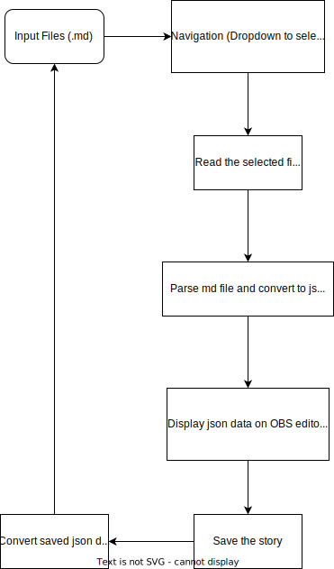
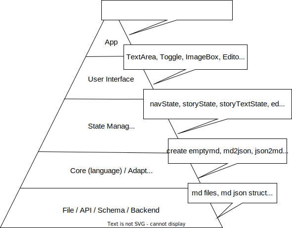

# TestAppOBSEditor

## Overview

This rcl provides ui, custom hooks and functions for editing and displaying the open bible stories.

## Tech Stack
- ReactJS for UI & state management
- Pure JS for core functions
- Vite for running a sandbox for dev mode
- Styleguidist for demoing our library

This Library uses reactjs for user interface & state management functionality and pure Js for core functionality

### Links

[Styleguide](https://testrcl-obs-editor.netlify.app)

### User Interfaces
- EditorPanel - display and edits the content of one OBS story

### Custom hooks

- useStory - handles the state of a obs story and provides actions for a story

### Core Functions

- mdToJson : Parses the obs .md string and converts to story json object 

## How to run the app
- git clone `https://github.com/AnuMonachan/testapp.git`
- yarn install

### Note on Package Manager
- we are using yarn

### Run in Development Mode
- run using yarn run dev 

### Run in Styleguide
- use command yarn start to open styleguidist

### How to install library
- `yarn add testrcl`

## Other RCLs we use
- React Json View to display the display json output in useStory
#### Diagrams

#### Layers Diagram

#### Architecture Diagram